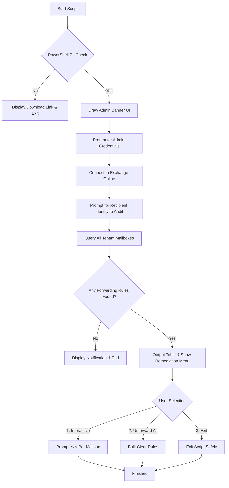

# Internal Mailbox Forwarding Management Tool

A utility designed for tenant-wide auditing and remediation of internal mailbox forwarding rules. This tool helps Exchange administrators discover and remove email forwarding settings targeting a specific internal recipient.

> [!IMPORTANT]
> **PowerShell Version Requirement**
> This script requires **PowerShell 7.0 or higher** to run.
> If you are running an older version (like Windows PowerShell 5.1), you can download the latest installer from the official [PowerShell Releases](https://github.com/PowerShell/PowerShell/releases) page or download the [PowerShell 7.6.2 Windows x64 MSI](https://github.com/PowerShell/PowerShell/releases/download/v7.6.2/PowerShell-7.6.2-win-x64.msi).

---

## Features

- **PowerShell 7 Enforced Check**: Gracefully exits with installation/download instructions if run under an unsupported PowerShell version.
- **ExchangeOnlineManagement Module Check**: Verifies that the required Exchange Online module is installed, providing setup commands if it is missing.
- **Exchange Online Integration**: Automates connection to Exchange Online using standard modern authentication prompts.
- **Tenant-Wide Auditing**: Scans all mailboxes in the tenant to detect active forwarding rules to the target recipient.
- **Interactive Remediation Menu**:
  - **Interactive Check (Option 1)**: Prompt for confirmation (`Y/N`) for each mailbox before clearing the forwarding address.
  - **Bulk Clean (Option 2)**: Unforward all detected mailboxes at once after a double-confirmation prompt.
  - **Safe Exit (Option 3)**: Terminate the script and display the final findings without altering any forwarding rules.

---

## Prerequisites

Before running the script, ensure you have:
1. **PowerShell 7+** installed.
2. The **ExchangeOnlineManagement** PowerShell module. You can install it by running the following command in PowerShell 7 as Administrator:
   ```powershell
   Install-Module -Name ExchangeOnlineManagement -Force
   ```
3. An administrative account with **Exchange Administrator** or **Global Administrator** permissions.

---

## How to Run

1. Open PowerShell 7 (`pwsh.exe`).
2. Navigate to the script directory:
   ```powershell
   cd "<location-where>\Email Tools"

   ```
3. Run the script:
   ```powershell
   .\'forwarded emails.ps1'
   ```

---

## How it Works


